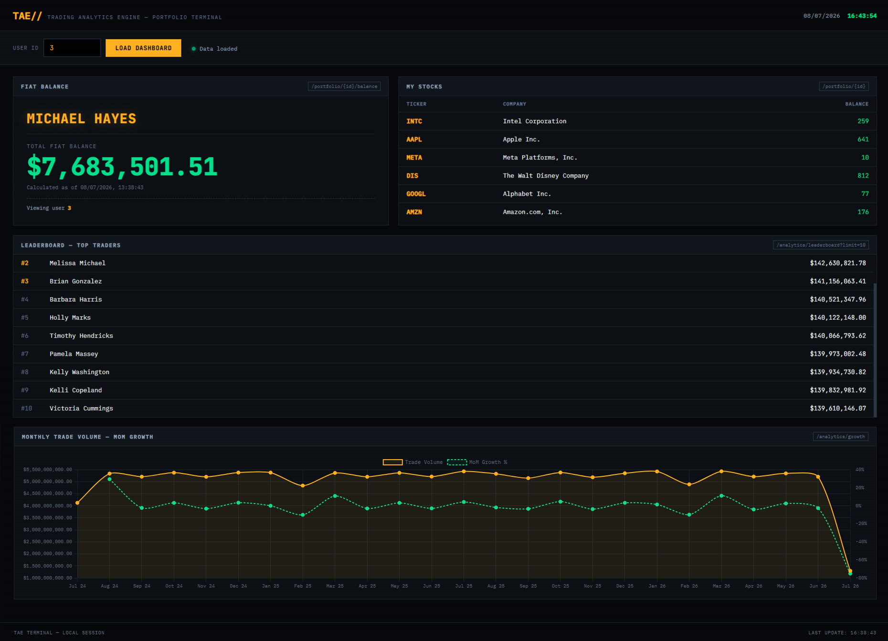
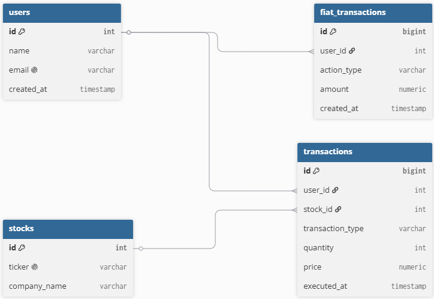

# TAE // Trading Analytics Engine
[](https://github.com/Tacitus-SL/trading-portfolio-analytics/actions/workflows/ci.yml)

An asynchronous, high-performance API and Web Terminal for analyzing user trading portfolios and stock market data. Designed to handle large datasets (1,000,000+ transactions) with optimized database architecture, strict data integrity, and complex SQL analytics.




## Tech Stack
* **Backend:** Python 3.10+, FastAPI, `asyncpg` (Connection Pooling), Pydantic
* **Database:** PostgreSQL (Advanced SQL, CTEs, Window Functions, B-Tree Indexes)
* **Frontend:** Vanilla JS, HTML/CSS, Chart.js (Served via Jinja2)
* **Infrastructure:** Docker, Docker Compose
* **Testing & CI/CD:** Pytest (Integration testing with DB isolation), GitHub Actions
* **Data Generation:** `Faker`, `psycopg2` (Batch inserts via `execute_values`)

## Key Engineering Features
1. **Highload Data Simulation:** Custom Python script generating 1M+ realistic trading and fiat transactions, inserting them via batching in under 20 seconds.
2. **"Time-Travel" Ledger:** Fiat balance isn't hardcoded. It is calculated dynamically based on historical deposits, withdrawals, and trading volume up to any specific timestamp using CTEs.
3. **Database Optimization:** Analyzing queries with `EXPLAIN ANALYZE` revealed a bottleneck (146ms per query). By implementing **B-Tree indexes**, execution time was reduced to **0.5ms (~300x performance increase)**.
4. **Data Integrity:** Strict constraints (`CHECK quantity > 0`, `ENUM` types, `ON DELETE CASCADE`) shift data validation from the application layer directly to the database.
5. **Automated CI Pipeline:** Every push triggers an isolated GitHub Actions environment that spins up PostgreSQL, runs Pytest integration tests, and builds the Docker image.

## Project Structure
```text
├── .github/workflows/   # CI/CD Pipeline configuration (GitHub Actions)
├── static/ & templates/ # Vanilla JS/HTML frontend (Terminal UI)
├── tests/               # Pytest integration tests (DB isolation per test)
├── Dockerfile           # Backend image configuration
├── docker-compose.yml   # Multi-container orchestration (API + DB)
├── generate_data.py     # 1M+ rows data generation script
├── main.py              # FastAPI application & endpoints
├── schema.sql           # DB schema, types, and indexes (Auto-runs in Docker)
└── requirements.txt     # Python dependencies
```

## Core SQL Analytics

**1. Time-Travel Fiat Balance Calculation**
Calculates the exact real-money balance by summarizing deposits, withdrawals, and trading spendings.
```sql
WITH fiat_flow AS (
    SELECT SUM(CASE WHEN action_type = 'DEPOSIT' THEN amount ELSE -amount END) AS cash_balance
    FROM fiat_transactions WHERE user_id = $1 AND created_at <= $2
),
trading_flow AS (
    SELECT SUM(CASE WHEN transaction_type = 'SELL' THEN (price * quantity) 
                    WHEN transaction_type = 'BUY' THEN -(price * quantity) END) AS trade_balance
    FROM transactions WHERE user_id = $1 AND executed_at <= $2
)
SELECT 
    u.name AS user_name,
    COALESCE((SELECT cash_balance FROM fiat_flow), 0) + 
    COALESCE((SELECT trade_balance FROM trading_flow), 0) AS total_fiat_balance
FROM users AS u WHERE u.id = $1;
```
**2. MoM Growth & Cohort Analysis (Window Functions)**
Calculates Month-over-Month trading volume growth using LAG() over time intervals.
```sql
WITH monthly_volumes AS (
    SELECT DATE_TRUNC('month', executed_at) AS trade_month, SUM(quantity * price) AS current_volume
    FROM transactions GROUP BY trade_month
),
volumes_with_lag AS (
    SELECT trade_month, current_volume, LAG(current_volume) OVER (ORDER BY trade_month) AS previous_volume
    FROM monthly_volumes
)
SELECT trade_month, current_volume, previous_volume,
       ROUND(((current_volume - previous_volume) / NULLIF(previous_volume, 0)) * 100, 2) AS growth_percentage
FROM volumes_with_lag;
```

## Database Schema


## How to Run
**1. Clone the repository & set up environment variables:**
```bash
git clone https://github.com/YOUR_USERNAME/YOUR_REPO_NAME.git
cd YOUR_REPO_NAME
cp .env.example .env
```

**2. Spin up the containers:**
```bash
docker-compose up -d --build
```

**3. Generate 1,000,000+ test records:**
```bash
docker exec -it tae_api python generate_data.py
```

**4.Access the Engine:**
* Web Terminal UI: `http://localhost:8000/`
* Swagger API Docs: `http://localhost:8000/docs`

**5. Run tests:**
```bash
docker exec -it tae_api pytest -v
```